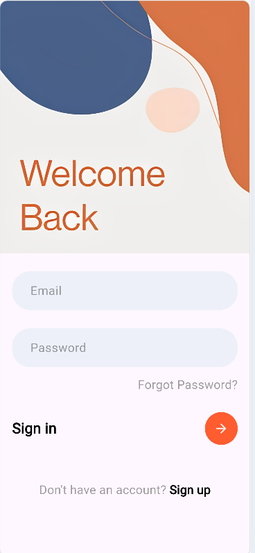
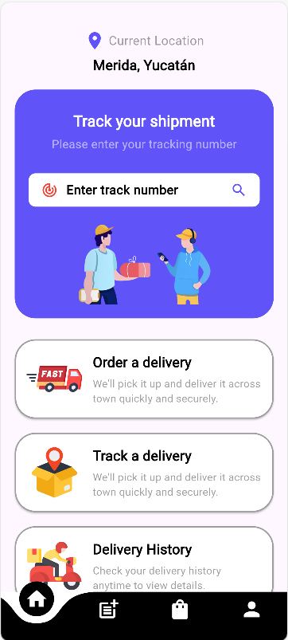
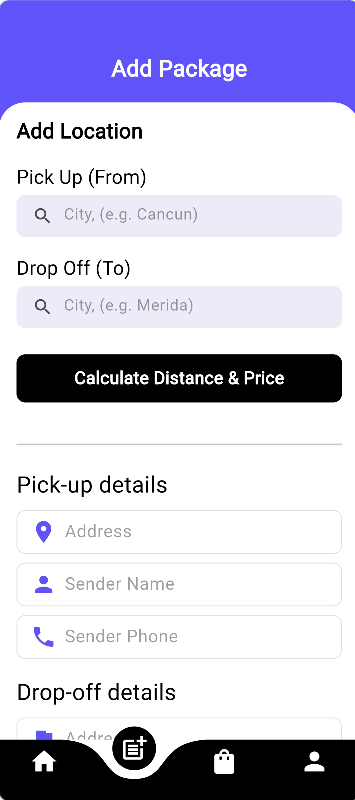
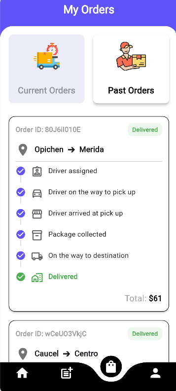
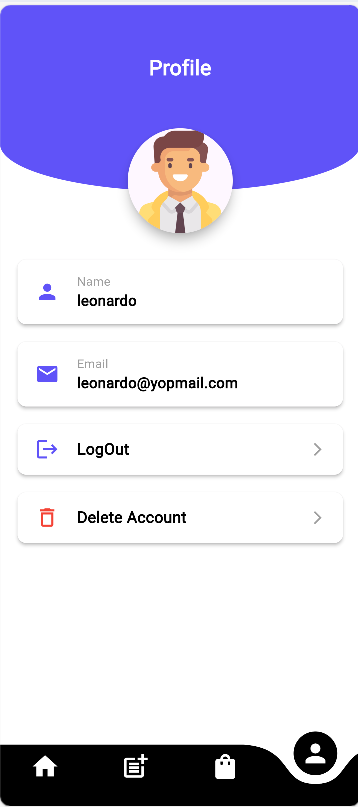

# 📦 Package Delivery App  
**English | Español**

---

## 🇺🇸 English

### 📘 Overview
Package Delivery App is a comprehensive mobile application built with Flutter that simulates a complete on-demand delivery service. It features user authentication, real-time location-based pricing, shipment tracking simulation, and order history management. The app leverages Firebase for a robust backend (Authentication & Cloud Firestore).

---

## ✨ Key Features

### 🔐 Secure Authentication
- Sign Up & Sign In with Email/Password  
- Forgot Password flow with email recovery  
- Secure Log Out and Account Deletion  

### 📍 Smart Geolocation & Pricing
- **Simulated** Converts address inputs (e.g., "Merida", "Opichen") into geographic coordinates  
- **Dynamic Pricing:** Calculates the distance between pick-up and drop-off points using Geolocator logic to generate automated price estimates  
- **Auto-fill Forms:** Automatically populates address fields after calculation  

### 💳 Simulated Payment Gateway
- Integrated bottom sheet for payment simulation  
- Visual feedback with loading states and success confirmation  

### 🚚 Real-time Tracking Simulation
- Interactive timeline UI with animated progress  
- Simulates status changes (Driver Assigned → In Transit → Delivered) using state management and timers  
- Automatically updates order status in Firestore upon completion  

### 📦 Order Management
- **Current Orders:** Filters active shipments  
- **Past Orders:** Automatically archives delivered packages  
- **Search Functionality:** Search orders by Tracking ID from the Home screen  

### 👤 User Profile
- Displays user information retrieved from Cloud Firestore  

---

## 🛠 Tech Stack

**Framework:** Flutter (Dart)  
**Backend:** Firebase (Auth, Firestore)  

### 📦 Key Packages
- `firebase_core`, `firebase_auth`, `cloud_firestore`  
- `geocoding`, `geolocator` (Location services)  
- `random_string` (ID generation)  
- `curved_navigation_bar` (UI)  

---

## 🚀 Getting Started

### ✔️ Prerequisites
- Flutter SDK installed  
- Android Studio or VS Code  
- A physical Android device (recommended for GPS) or an emulator with Google Play Services  

---

## 🇪🇸 Español

### 📘 Descripción General
Package Delivery App es una aplicación móvil desarrollada en Flutter que simula un servicio de entrega de paquetes. Incluye autenticación de usuarios, precios dinámicos basados en ubicación (simulado), simulación de seguimiento de envíos y gestión del historial de órdenes. Utiliza Firebase como backend (Authentication y Cloud Firestore).

---

## ✨ Características Principales

### 🔐 Autenticación Segura
- Registro e inicio de sesión con Email y Contraseña  
- Recuperación de contraseña vía correo electrónico  
- Cierre de sesión y eliminación de cuenta seguros  

### 📍 Geolocalización Inteligente y Precios
- **simulado** generar una distancia aleatoria
- **Precio Dinámico:** Calcula distancia entre los puntos de recogida y entrega  
- **Auto-completado:** Llena automáticamente los campos después del cálculo  

### 💳 Pago Simulado
- Bottom sheet integrado para simular pagos  
- Feedback visual con estados de carga y confirmación  

### 🚚 Simulación de Seguimiento en Tiempo Real
- Línea de tiempo interactiva con animaciones  
- Cambios automáticos de estado (Conductor Asignado → En tránsito → Entregado)  
- Actualización automática del estado en Firestore  

### 📦 Gestión de Órdenes
- Órdenes actuales (activas)  
- Órdenes pasadas (entregadas)  
- Búsqueda por número de seguimiento  

### 👤 Perfil de Usuario
- Muestra la información del usuario desde Firestore  

---

## 🛠 Tecnologías
- Flutter (Dart)  
- Firebase Auth & Cloud Firestore  

---

## 🚀 Empezar

### ✔️ Requisitos
- Flutter SDK  
- Android Studio o VS Code  
- Dispositivo físico o emulador con Google Play Services  

---

## 📄 License
MIT License (optional)

## Login Screen

## Home & Tracking

## Order

## Details

## Profile

